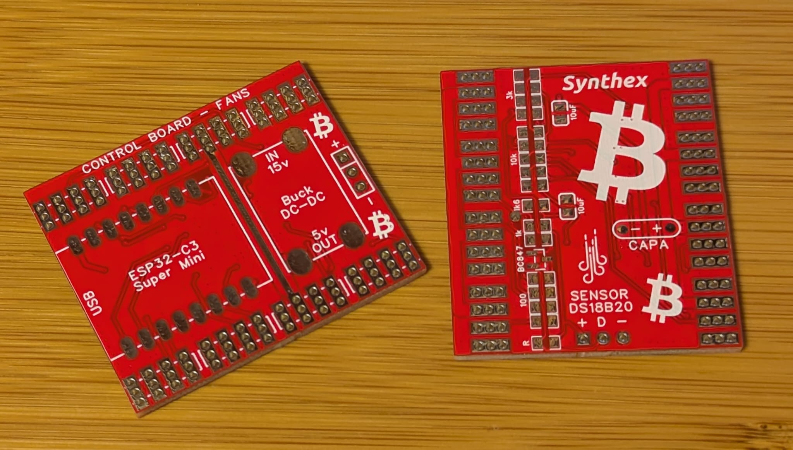

# Four-Fan Module
A small board that allows you to connect standard fans to the Antminer control board, with temperature sensors, for autonomous heating management.

- Dynamically regulate speed
- Avoid 100% at startup
- Simulation of the 4 original fans, with the RPMs that the control board wants to see
- Set a minimum speed if the fan is cooling power supply
- Network of temperature sensors DS18B20 for quite autonomous thermal management, fan speed based on hashboard temperature
- Open-source firmware with Home Assistant ESPHome YAML configuration file !
- External WiFi antenna to extend beyond the metal cover

